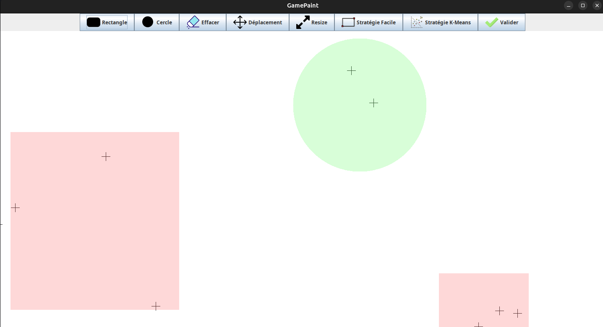

# PaintJava – Jeu de dessin stratégique



**Objectif du jeu :**  
Recouvrez tous les points présents à l’écran en utilisant **le moins de formes possible** (rectangles et cercles).  
Pour réussir, vous pouvez **créer**, **déplacer**, **redimensionner** ou **supprimer** les formes selon vos besoins.

---

## 🎮 Lancer le jeu

Assurez-vous d’avoir Java installé sur votre système, puis exécutez la commande suivante dans un terminal :

```bash
java -jar "GamePaint.jar"
```

## 🖌️ Contrôles et interactions

### ▶️ Créer une forme

- **Rectangle :**  
  Cliquez une fois, maintenez le clic, puis déplacez la souris jusqu'à la taille désirée avant de relâcher.

- **Cercle :**  
  Cliquez une première fois pour définir le **centre**, puis une seconde fois pour fixer le **rayon** (bord du cercle).

### 🔄 Déplacer une forme

- Cliquez sur une forme, maintenez le clic et faites-la glisser à l'endroit souhaité.

### 📏 Redimensionner une forme

- **Rectangle :**  
  Identique au déplacement : cliquez, maintenez et étirez la forme.

- **Cercle :**  
  Cliquez sur un cercle, maintenez le clic, puis utilisez **la molette de la souris** pour augmenter ou réduire son rayon.

### ❌ Supprimer une forme

- Cliquez simplement sur une forme pour la supprimer.